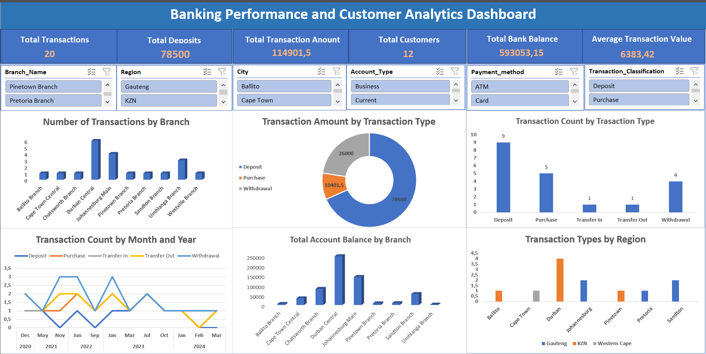

# Banking Data Analysis — SQL & Excel

## Project Overview
This project focuses on analysing banking data using SQL and Microsoft Excel. The banking database was created from scratch using SQL and consists of three related tables: `Branches`, `ClientRecords`, and `Trans`. Primary and foreign keys were used to establish relationships between branches, customer accounts, and transactions. SQL was used to perform data exploration and analysis, including customer account analysis, branch analysis, transaction analysis, joins, aggregations, filtering, subqueries, and customer segmentation. Selected SQL results were exported to Microsoft Excel, where PivotTables and charts were created to further explore and present the banking data. The project demonstrates an end-to-end data analysis workflow, from relational database creation and SQL querying to Excel-based analysis and visualisation.

## Objectives
The main objectives of this project were to:
- Create a relational banking database using SQL.
- Create and populate tables for branches, customers, and transactions.
- Establish relationships between tables using primary and foreign keys.
- Analyse customer accounts and account balances.
- Analyse branch-level account and balance information.
- Explore transaction activity and transaction values.
- Identify high-value customers and branches.
- Use SQL joins and subqueries to answer business-related questions.
- Categorise customers based on their account balances.
- Create a SQL view for consolidated dashboard analysis.
- Export SQL results to Excel.
- Use PivotTables and charts to explore and communicate the results.

## Database Design
The database was created from scratch and contains three main tables.

### Branches
The `Branches` table contains information about bank branches, including:
- Branch Code
- Branch Name
- Branch Manager
- Branch Address
- City
- Region

### ClientRecords
The `ClientRecords` table contains customer account information, including:
- Account Number
- First Name
- Surname
- Account Type
- Client Address
- Date Opened
- Account Status
- Account Balance
- Branch Code

### Trans
The `Trans` table contains transaction information, including:
- Transaction ID
- Account Number
- Branch Code
- Transaction Date
- Transaction Classification
- Payment Method
- Amount
Primary and foreign keys were used to establish relationships between the tables and connect customers and transactions to their respective branches.

## SQL Analysis
The SQL analysis explored customer accounts, branches, transactions, and customer behaviour.

### Customer and Account Analysis
The analysis included:
- Total number of accounts.
- Number of customers by account type.
- Average account balance.
- Highest and lowest account balances.
- Customers with balances above R50,000.
- Account type with the highest average balance.
- Customers with above-average account balances.

### Branch Analysis
The analysis included:
- Number of accounts by branch.
- Total customer balance by branch.
- Branch with the highest total customer balance.
- Branch with the highest number of customers.
- Average account balance by branch.
- City with the highest total customer balance.
- Branches with no recorded transactions.

### Transaction Analysis
The analysis included:
- Total transaction value.
- Number of transactions.
- Average transaction amount.
- Largest transaction.
- Number of deposits, withdrawals, and transfers.
- Total amount deposited.
- Total amount withdrawn.
- Branches processing the highest number of transactions.

### Customer Transaction Analysis
The analysis included:
- Customers who have made transactions.
- Customers who have never made a transaction.
- Customers who have both deposits and withdrawals.
- Top 5 customers by total transaction value.
- Customers with transactions above the average transaction amount.
- Customer transaction history.

### Customer Segmentation
Customers were categorised according to their account balance using a SQL `CASE` expression:
- Low Balance
- Medium Balance
- High Balance

## Advanced SQL Analysis
The project also included more advanced SQL techniques.

### Joins
Multiple tables were combined using:
- `JOIN`
- `LEFT JOIN`
This allowed customer, branch, account, and transaction information to be analysed together.

### Subqueries
Subqueries were used to answer questions such as:
- Which branch has the highest total customer balance?
- Which customers have never made a transaction?
- Which customers have balances above the overall average?
- Which customers have both deposits and withdrawals?

### Aggregation and Ranking
Aggregate functions and grouping were used to calculate:
- Counts
- Total balances
- Average balances
- Transaction totals
- Average transaction values
`TOP` and `ORDER BY` were also used to identify high-value customers and other ranked results.

### Customer Segmentation
A `CASE` expression was used to classify customers according to their account balances.

## SQL Dashboard View
A reusable SQL view named `vw_Dashboard` was created by combining customer, branch, and transaction information. The view provides a consolidated dataset that can be used for further analysis and dashboard development.

## Excel Analysis
Selected results from the SQL analysis were exported to Microsoft Excel for further exploration.
Excel was used to:
- Organise and explore SQL results.
- Create PivotTables.
- Summarise customer and transaction information.
- Compare banking metrics.
- Create charts.
- Identify patterns across branches, customers, accounts, and transactions.
- Support dashboard development.

## Excel Dashboard
The Excel results were used to create a dashboard that visually presents the banking analysis. The dashboard provides a visual way to explore the results and identify patterns in customer accounts, branches, balances, and transaction activity.

### Excel Dashboard

## Project Workflow
The project followed the following workflow:
1. Designed the relational banking database.
2. Created the database using SQL.
3. Created the `Branches`, `ClientRecords`, and `Trans` tables.
4. Established relationships using primary and foreign keys.
5. Inserted banking data into the tables.
6. Explored and analysed the data using SQL.
7. Used joins, aggregations, filtering, subqueries, ranking, and conditional logic.
8. Created the `vw_Dashboard` SQL view.
9. Exported selected SQL results to Excel.
10. Created PivotTables and charts in Excel.
11. Developed a dashboard to visually explore the banking data.

## SQL Skills Demonstrated
- Database creation
- Table creation
- Relational database design
- Primary keys
- Foreign keys
- `SELECT`
- `WHERE`
- `GROUP BY`
- `ORDER BY`
- `JOIN`
- `LEFT JOIN`
- Aggregate functions
- `COUNT()`
- `SUM()`
- `AVG()`
- `MIN()`
- `MAX()`
- `TOP`
- Subqueries
- `CASE`
- `BETWEEN`
- `DISTINCT`
- `CREATE VIEW`
- 
## Excel Skills Demonstrated
- Data exploration
- PivotTables
- Data summarisation
- Chart creation
- Dashboard development
- Visual analysis
- Business-focused reporting

## Tools Used
- **SQL Server / SQL** — database creation, relational database design, querying, and analysis
- **Microsoft Excel** — data exploration, PivotTables, charts, and dashboard development
